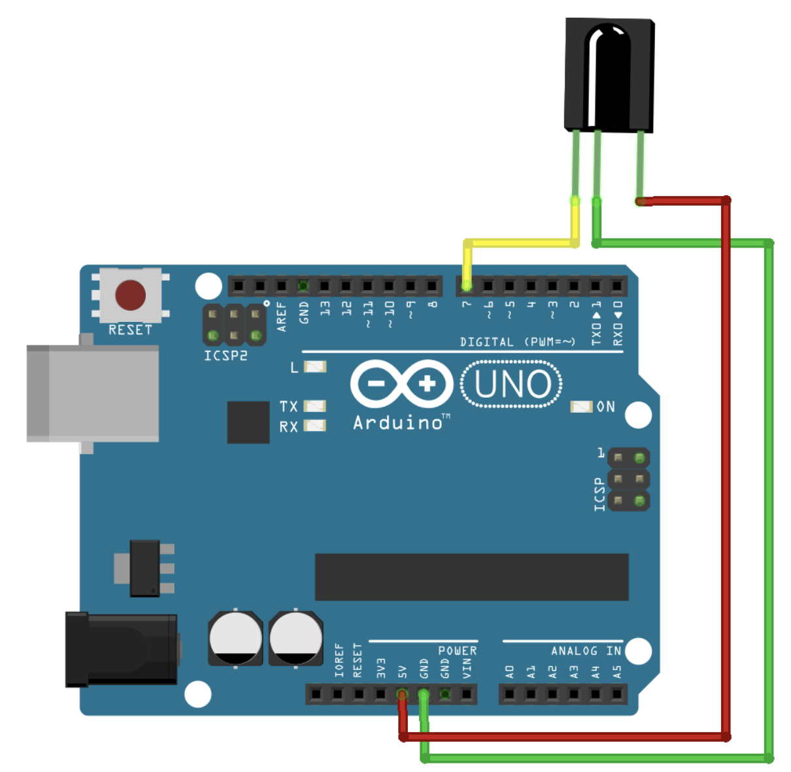

# 紅外線發射接收模組教學

## 簡介
紅外線模組可用於遙控器功能實現，包含發射和接收兩個部分。本教學將介紹如何使用紅外線模組進行基本通訊。

## 硬體需求
### 接收端
- IR 接收器模組 (如 VS1838B)
- 連接線

### 發射端
- IR LED 發射器
- 220Ω 電阻
- 連接線

## 接線說明
### 接收模組
- VCC: 接開發板 5V(建議)/3.3V
- GND: 接開發板 GND
- OUT: 接數位輸入腳位

### 接收模組線路圖

### 發射模組
- IR LED 正極通過 220Ω 電阻接數位輸出腳位
- IR LED 負極接 GND

## 程式範例
1. 接收程式 (ir_receive.ino)
   - 接收並解碼 IR 信號
   - 顯示接收到的代碼

2. 發射程式 (ir_transmit.ino)
   - 發送特定 IR 代碼
   - 模擬遙控器功能

## 應用範例
- 自製遙控器
- 家電控制
- 紅外線通訊系統

## 注意事項
- 避免強光干擾接收器
- 確保發射器與接收器之間無遮擋
- 不同協議可能需要不同的程式庫

## 參考連結
- [ReceiveDemo](https://github.com/Arduino-IRremote/Arduino-IRremote/blob/master/examples/ReceiveDemo/ReceiveDemo.ino)
- https://blog.jmaker.com.tw/irremoterecv/

