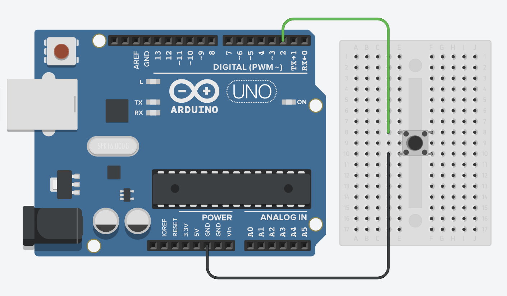

# 按鈕控制教學

## 簡介
按鈕是常用的輸入元件，可以用來控制各種互動功能。本教學將介紹如何使用按鈕進行基本控制。

## 硬體需求
- 按鈕開關 x1
- LED x1 (用於測試)
- 220Ω 電阻 x1 (LED用)
- 麵包板
- 連接線

## 接線說明
- 按鈕一端接數位輸入腳位
- 按鈕另一端接地 (GND)
- 使用 INPUT_PULLUP 模式啟用內部上拉電阻

## 連接線圖

## 程式範例
1. 基礎按鈕控制 (basic_button.ino)
   - 按下按鈕點亮LED
   - 放開按鈕熄滅LED
2. 進階按鈕控制 (advanced_button.ino)
   - 按鈕開關狀態切換
   - 防彈跳處理

## 注意事項
- 使用 INPUT_PULLUP 模式時，按鈕未按下為 HIGH，按下為 LOW
- 注意按鈕的彈跳現象
- 不同開發板的電壓可能不同，請確認規格