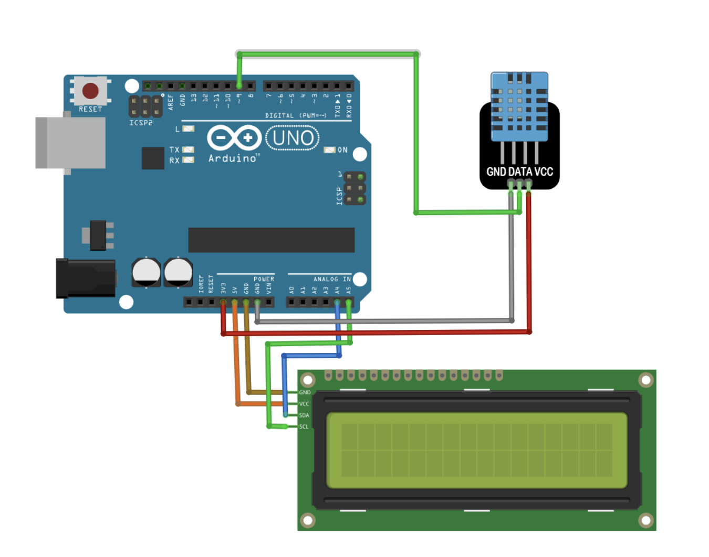

# DHT 溫濕度感測器教學

## 簡介
DHT11/DHT22 是常用的數位溫濕度感測器，可同時測量環境溫度和相對濕度。本教學將介紹如何使用 DHT 系列感測器進行環境監測。

## 硬體需求
- DHT11 或 DHT22 感測器
- 連接線

## 連接線圖

## DHT11 vs DHT22 比較
### DHT11
- 溫度範圍：0-50°C (±2°C)
- 濕度範圍：20-90% RH (±5% RH)
- 採樣率：0.5Hz (每2秒一次)
- 價格較低

### DHT22
- 溫度範圍：-40-80°C (±0.5°C)
- 濕度範圍：0-100% RH (±2% RH)
- 採樣率：0.5Hz (每2秒一次)
- 精確度較高

## 接線說明
- VCC: 接 3.3V-5V
- GND: 接 GND
- DATA: 接數位腳位（需加 4.7kΩ 上拉電阻）

## 程式範例
1. 基礎讀取 (basic_dht.ino)
   - 溫度讀取
   - 濕度讀取
   - 序列埠顯示

2. 進階應用 (advanced_dht.ino)
   - 資料記錄
   - 警報功能
   - LCD 顯示

## 應用範例
- 室內環境監測
- 溫室控制系統
- 氣象站
- 智慧家居
- 資料收集與分析

## 注意事項
- 讀取間隔至少 2 秒
- 避免陽光直射
- 遠離熱源干擾
- 保持感測器清潔
- 確認上拉電阻連接
- 檢查供電電壓穩定性