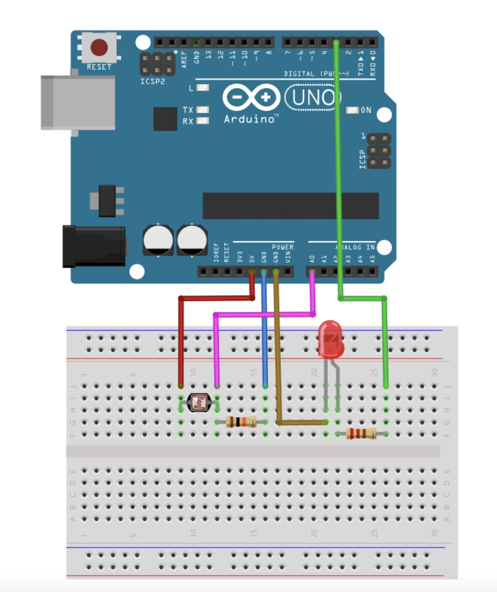

# 光敏感測器模組教學

## 簡介
光敏感測器（Light Dependent Resistor, LDR）可以感測環境光線強度，常用於自動照明、光控開關等應用。光敏電阻的特性是當環境光線增強時，其電阻值會降低；當環境光線減弱時，電阻值會增加。這種特性使其非常適合用於光線檢測和自動控制系統。

## 硬體需求
- 光敏電阻模組或光敏電阻
- 10kΩ 分壓電阻（如果使用單個光敏電阻）
- LED 指示燈（選配）
- 連接線

## 接線說明
### 模組版本
- VCC -> 5V
- GND -> GND
- AO -> 類比輸入腳位（如 A0）
- DO -> 數位輸入腳位（選配）

### 分壓電路版本
- 光敏電阻一端 -> 5V
- 光敏電阻另一端 -> 10kΩ 電阻 + A0
- 10kΩ 電阻另一端 -> GND

### 連接線圖

## 功能特點
- 類比/數位輸出
- 可調節靈敏度（模組版本）
- 即時光線強度檢測
- 低光照警報功能

## 程式範例
1. 基礎讀取 (basic_light.ino)
   - 光線強度讀取
   - LED 指示
   - 序列埠顯示

2. 自動照明 (auto_light.ino)
   - 光控 LED
   - 閾值設定
   - 平滑變化

## 注意事項
- 避免直射光線
- 保持感測器清潔
- 定期校正閾值
- 考慮環境光線變化