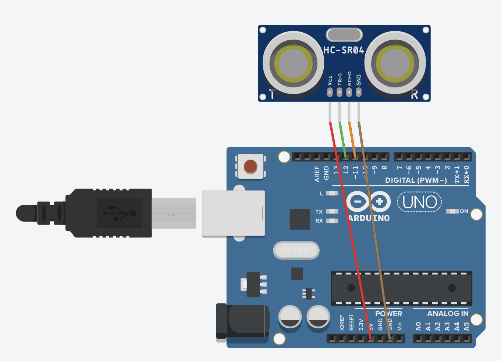

# 超音波感測器教學

## 簡介
超音波感測器（HC-SR04）可以測量物體距離，常用於避障、距離測量等應用。本教學將介紹如何使用超音波感測器進行距離測量。

## 硬體需求
- HC-SR04 超音波感測器
- 連接線 x4
- LED 指示燈（選配）
- 蜂鳴器（選配）

## 接線說明
- VCC: 接開發板 5V
- GND: 接開發板 GND
- TRIG: 接數位輸出腳位（觸發信號）
- ECHO: 接數位輸入腳位（回波信號）

### 連接線圖

## 工作原理
1. 發送觸發信號（10μs 高電平）
2. 感測器發射超音波
3. 接收回波信號
4. 根據時間差計算距離

## 程式範例
1. 基礎距離測量 (distance_measure.ino)
   - 連續測量距離
   - 透過序列埠顯示數據

2. 進階應用
   - 距離警報系統
   - 自動避障功能
   - 液位測量

## 注意事項
- 測量範圍：2cm ~ 400cm
- 測量角度：15度
- 避免感測器受到干擾
- 平整表面測量效果最佳