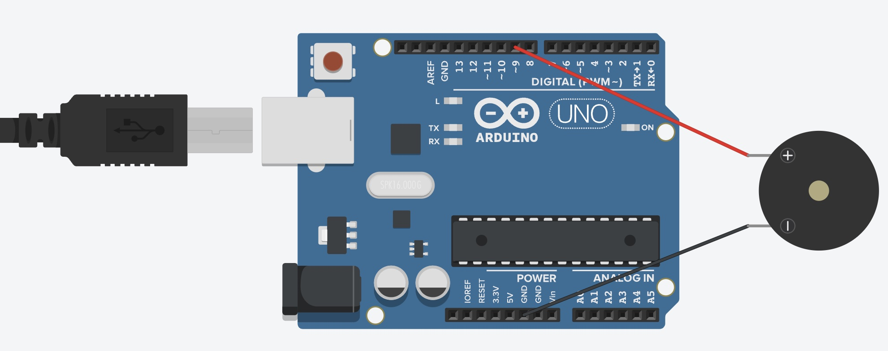

# 蜂鳴器模組教學

## 簡介
蜂鳴器可以發出不同頻率的聲音，常用於警報或音樂播放。本教學介紹如何使用有源和無源蜂鳴器。

## 硬體需求
- 有源或無源蜂鳴器
- 100Ω 電阻（可選）
- 連接線

## 如何判斷蜂鳴器類型
### 外觀判斷
- 有源蜂鳴器通常有內建振盪器，體積較大
- 無源蜂鳴器體積較小，外觀較簡單

### 測試方法
1. 外觀辨識
   - 有源蜂鳴器和無源蜂鳴器外型相似
   - 有源蜂鳴器通常有白色貼紙
   - 有源蜂鳴器底部有膠封
   - 無源蜂鳴器底部可直接看到電路板

2. 直接供電測試
   - 有源蜂鳴器接上電源即會發聲
   - 無源蜂鳴器接上電源不會發聲

3. 標示判斷
   - 有源通常標示工作電壓（如 5V）
   - 無源通常標示頻率範圍

## 接線說明
### 有源蜂鳴器
- 正極接數位輸出腳位
- 負極接 GND

### 無源蜂鳴器
- 一端接 PWM 輸出腳位
- 另一端接 GND

## 程式範例
1. 基礎音調 (basic_tone.ino)
   - 發出固定頻率聲音
   - 簡單的警報聲

2. 音樂播放 (melody.ino)
   - 播放簡單旋律
   - 音符頻率控制

## 應用範例
- 警報系統
- 按鍵音效
- 簡單音樂盒

## 注意事項
- 避免長時間高分貝輸出
- 注意蜂鳴器類型（有源/無源）
- PWM 腳位的使用（無源蜂鳴器）

## 參考資源
- [Arduino 蜂鳴器教學](https://blog.jmaker.com.tw/arduino-buzzer/)