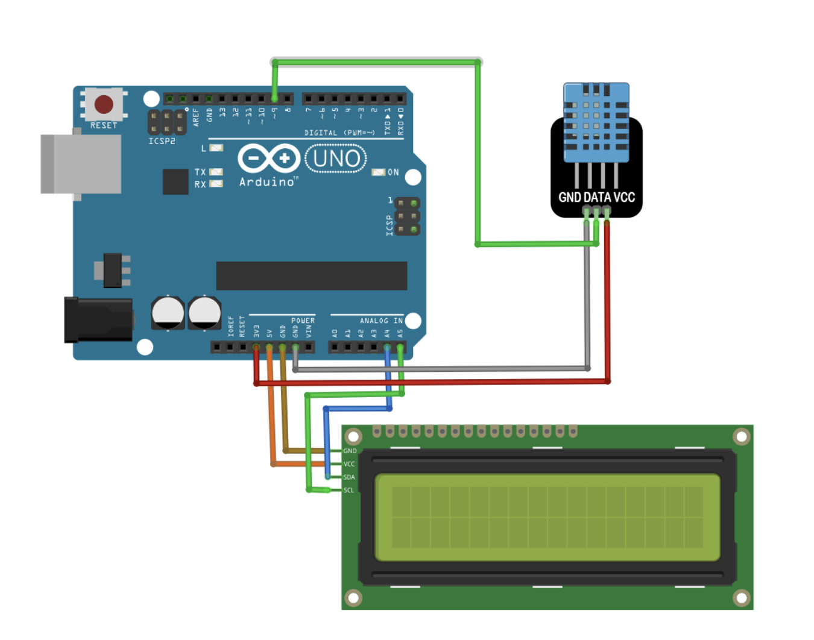

# LCD 顯示器模組教學

## 簡介
LCD 顯示器可以顯示文字和簡單圖形，本教學使用 I2C 介面的 1602 LCD 顯示器。

## 硬體需求
- 1602 LCD 顯示器（I2C 介面）
- I2C 轉接板（如果 LCD 沒有內建）
- 連接線 x4

## 接線說明
- VCC -> 5V
- GND -> GND
- SDA -> A4 (Arduino UNO)
- SCL -> A5 (Arduino UNO)

## 功能特點
- 16字元 x 2行顯示
- 可顯示中文（需自定義字元）
- 背光控制
- 可調對比度

## 程式範例
1. 基礎顯示 (basic_display.ino)
   - 文字顯示
   - 游標控制
   - 捲動效果

2. 自定義字元 (custom_chars.ino)
   - 創建特殊符號
   - 動畫效果

## 注意事項
- 檢查 I2C 位址（一般是 0x27 或 0x3F）
- [調整對比度電位器](https://blog.jmaker.com.tw/1602-lcd-tips/)
- 注意電源供應穩定性