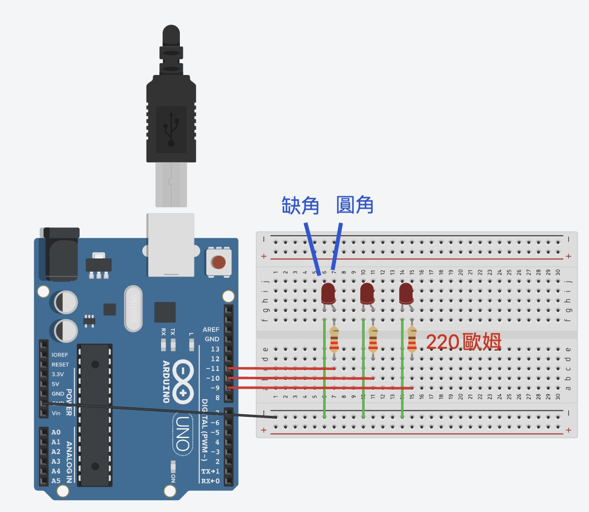

# LED 控制教學

## 簡介
LED（發光二極體）是最基本的輸出元件，本教學將介紹從基礎到進階的 LED 控制技巧。

## 硬體需求
- LED（建議使用不同顏色）
- 220Ω 限流電阻
- 麵包板
- 連接線

## 功能特點
1. 基礎控制
   - 開關控制
   - 簡單閃爍

2. PWM 控制
   - 亮度調整
   - 呼吸燈效果
   - 平滑漸變

3. 多重 LED 控制
   - 跑馬燈效果
   - 同步控制
   - 交替閃爍

4. 進階模式
   - 自定義閃爍模式
   - 摩斯密碼
   - 動態效果

## 接線說明
### 基本接線
- LED 正極（長腳）-> 220Ω 電阻 -> Arduino 數位腳位
- LED 負極（短腳/可看到燈泡有底座有切口）-> GND

### PWM 控制
- 使用帶有 ~ 符號的腳位（Arduino UNO: 3, 5, 6, 9, 10, 11）

## 程式範例
1. 基礎控制 (basic_blink.ino)
   - LED 開關
   - 基本閃爍

2. 進階控制 (advanced_led.ino)
   - PWM 呼吸燈
   - 多重 LED 控制
   - 閃爍模式

## 常見問題
1. LED 不亮
   - 檢查極性是否正確
   - 確認電阻值適當
   - 驗證腳位設定

2. LED 亮度過暗
   - 檢查電阻值是否過大
   - 確認 PWM 值設定
   - 驗證電源供應

3. PWM 控制無效
   - 確認使用正確的 PWM 腳位
   - 檢查 analogWrite 數值範圍（0-255）

## 進階應用
- 互動式燈光控制
- 音樂節奏燈
- 環境感應燈光
- 狀態指示器

## 注意事項
- 務必使用限流電阻
- 注意 LED 極性
- PWM 腳位選擇正確
- 避免過大電流

## 限流電阻的重要性
### 為什麼需要限流電阻？
LED 是一種二極體，其特性是：
- 導通電壓固定（約 2-3V）
- 電流與電壓不成線性關係
- 沒有自身限流能力

### 不使用限流電阻的危害
1. 立即性傷害
   - LED 瞬間燒毀
   - 可能產生高溫
   - LED 內部焊點熔化

### LED 燒壞的模式
1. 開路模式（最常見）
   - LED 內部鍵結斷裂
   - 完全不導通
   - 永久性損壞，無法修復

2. 短路模式（較少見）
   - LED 芯片熔化造成內部短路
   - 會持續導通
   - 可能造成電源短路

3. 部分損壞
   - 亮度明顯降低
   - 不穩定閃爍
   - 顏色改變

### 判斷 LED 是否燒壞
1. 外觀檢查
   - 燒黑痕跡
   - 塑膠外殼變形
   - 內部焊線斷裂可見

2. 測試方法
   - 使用三用電表二極體檔位測試
   - 更換已知正常的限流電阻測試
   - 嘗試反向接線確認

### 如何選擇合適的限流電阻
計算公式：R = (Vs - Vf) / I
- Vs：供應電壓（Arduino 5V）
- Vf：LED 導通電壓（約 2V）
- I：期望電流（通常 20mA）

範例：
- 5V 供電，LED 導通電壓 2V，目標電流 20mA
- R = (5V - 2V) / 0.02A = 150Ω
- 實務上常用 220Ω 提供安全餘裕