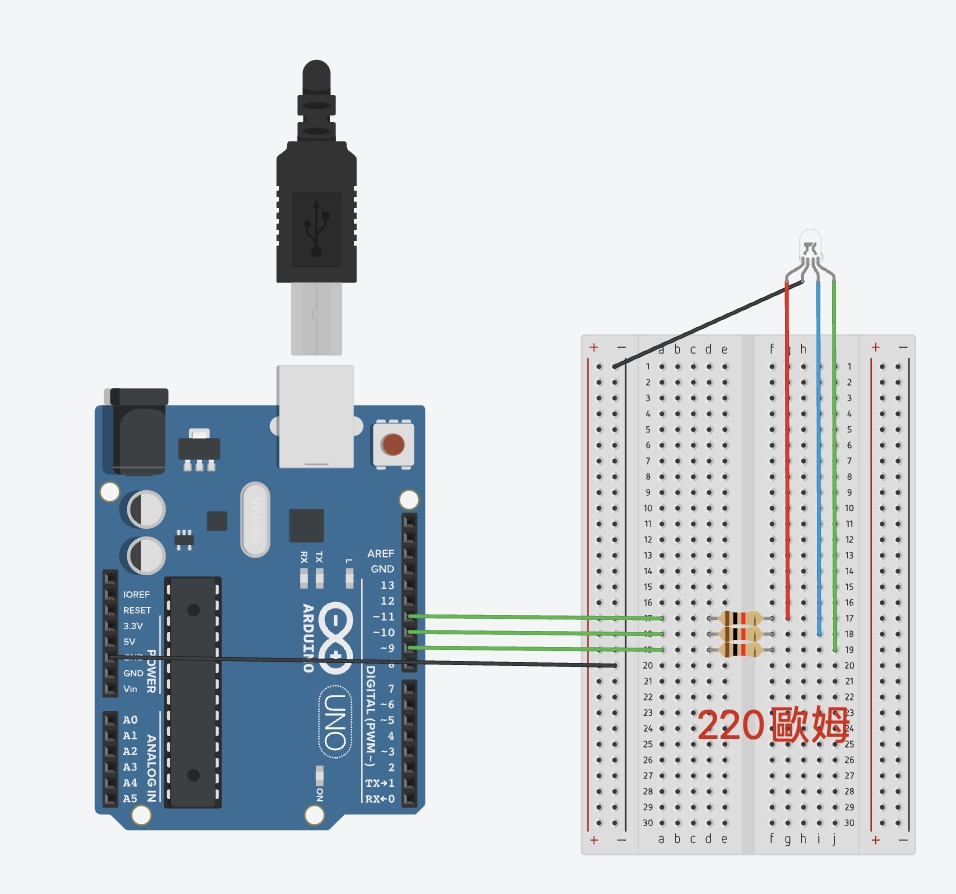

# RGB LED 模組教學

## 簡介
RGB LED 是一種可以顯示各種顏色的 LED，由紅、綠、藍三個 LED 組成。通過控制三個顏色的亮度，可以混合出不同的顏色。

## 硬體需求
- RGB LED（共陰極或共陽極）
  - 共陰極：共同腳接地，RGB腳位輸入正電壓(圖示使用共陰極)
  - 共陽極：共同腳接5V電源，RGB腳位輸入負電壓
- 電阻 x3（220Ω）
  - 用於限制每個 LED 的電流
  - 保護 LED 避免燒毀
- 連接線

## 接線說明

### 共陰極 RGB LED
- 共同腳（最長腳）接 GND
- R 腳經過電阻接 PWM 腳位
- G 腳經過電阻接 PWM 腳位
- B 腳經過電阻接 PWM 腳位

### 共陽極 RGB LED
- 共同腳（最長腳）接 5V
- R 腳經過電阻接 PWM 腳位
- G 腳經過電阻接 PWM 腳位
- B 腳經過電阻接 PWM 腳位

## 程式範例
1. 基礎顏色控制 (basic_colors.ino)
   - 顯示基本顏色
   - RGB 數值控制

2. 顏色漸變效果 (color_fade.ino)
   - 顏色平滑過渡
   - 彩虹效果

## 應用範例
- 情境燈光
- 狀態指示
- 互動裝置

## 注意事項
- 確認 LED 類型（共陰極/共陽極）
- 必須使用 PWM 腳位
- 注意電流限制